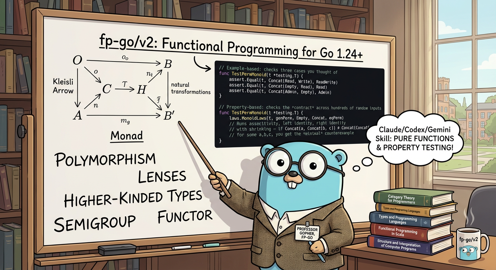

# fp-go Skill Marketplace

[](https://scorecard.dev/viewer/?uri=github.com/franchb/fp-go-skill)
[](https://github.com/franchb/fp-go-skill/attestations)
[](https://opensource.org/licenses/Apache-2.0)

<p align="center">
  
</p>

A Claude Code plugin marketplace providing functional programming guidance for Go projects using [fp-go/v2](https://github.com/IBM/fp-go).

## Installation

### Claude Code Marketplace

```bash
claude plugin marketplace add franchb/fp-go-skill
```

### Browse and Install Plugins

```text
/plugin menu
```

### Local Development

To add the marketplace locally (e.g., for testing or development), navigate to the **parent directory** of this repository:

```bash
cd /path/to/parent  # e.g., if repo is at ~/projects/fp-go-skill, be in ~/projects
claude plugin marketplace add ./fp-go-skill
```

## What it does

- **Auto-detect**: When your project uses fp-go/v2 or fptest-go, Claude applies correct conventions automatically
- **Monad selection**: Interactive decision tree to pick the right type (Option, Result, IOResult, ReaderIOResult, Effect)
- **Code review**: Catches fp-go anti-patterns — wrong monad choice, imperative style, missing composition
- **Migration**: Step-by-step conversion of imperative Go to fp-go pipelines
- **Testing**: Property-based testing guidance with [fptest-go](https://github.com/franchb/fptest-go) — law verification, generators, FP-aware assertions, functional mocking
- **Deep reference**: Layered docs from compact cheatsheet to full API inventory (5,262 functions across 61 packages)

## Available Plugins

| Plugin | Description |
|--------|-------------|
| [fp-go](plugins/fp-go/) | Active FP guidance for Go projects using fp-go/v2 — monad selection, code review, migration, and testing |

## Usage

Invoke with `/fp-go` in any Claude Code session, or start working on a Go project that imports `github.com/IBM/fp-go/v2` or `github.com/franchb/fptest` — the skill activates automatically.

| Command | What it does |
|---------|-------------|
| `/fp-go` | Load fp-go conventions into the session |
| "which monad should I use?" | Interactive monad selection wizard |
| "review my fp-go code" | Check for anti-patterns and suggest improvements |
| "convert this to fp-go" | Step-by-step migration from imperative Go |
| "how should I test this?" | Test strategy — laws, properties, assertions, mocking |

## Documentation Layers

The skill loads a compact reference (~260 lines) by default and reads deeper docs on demand:

| File | Lines | When loaded |
|------|-------|-------------|
| SKILL.md | ~340 | Always (compact reference + guidance logic) |
| cookbook.md | 1,198 | Migration tasks, "how do I X?" |
| core-patterns.md | 1,598 | Type details, operations, composition |
| mastery.md | 1,437 | Advanced: Do-notation, DI, transformers, profunctors |
| full-reference.md | 6,080 | API lookup across all 61 packages |
| testing.md | ~900 | Property-based testing, law verification, FP assertions |

## Requirements

- Go 1.24+ (for generic type aliases)
- [fp-go/v2](https://github.com/IBM/fp-go) in your project
- [fptest-go](https://github.com/franchb/fptest-go) (optional, for testing guidance)

## Security

This skill restricts its tools to read-only operations (`Read`, `Grep`, `Glob`, `LSP`) via `allowed-tools` in the SKILL.md frontmatter. It cannot execute commands, write files, or make network requests.

All CI checks enforce:

- Prompt injection pattern detection on PRs
- Hidden Unicode character scanning
- `allowed-tools` presence verification
- Content integrity hash validation
- Secret scanning with push protection
- SLSA Level 3 provenance on releases

See [SECURITY.md](SECURITY.md) for the vulnerability reporting policy and release verification instructions.

## Contributing

We welcome contributions! Please see [CLAUDE.md](CLAUDE.md) for skill authoring guidelines.

## License

Apache-2.0
